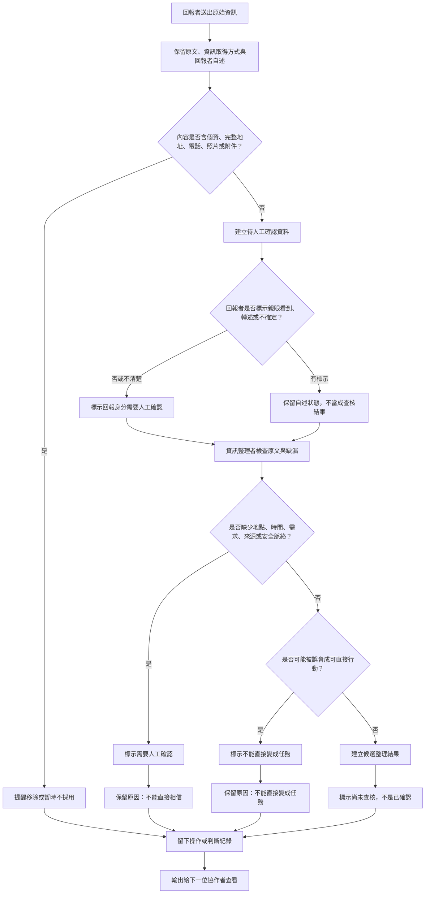

# v1 資訊流程設計

> 這份文件依 `release-packs/01-interview-kit/` 的訪談彙整與 `release-packs/02-flow-design-kit/` 的流程檢查要求整理。這是流程設計草稿，不是正式救災流程，也不是已確認資料模型。

## 我的 v1 目標

- 我優先服務的使用者：回報者。
- 這個使用者最想完成的事：快速留下自己知道的狀況，即使地點、數量、時間或需求還不完整，也能標示「親眼看到」「轉述」或「不確定」。
- 我最想避免的錯誤：回報一送出就被看成已確認，或被整理成可以直接派人的志工任務。

## 自然語言流程描述

回報者先從原始資訊入口留下回報內容。系統只把這些內容視為「原始資訊」，保留原文、不確定欄位、資訊取得方式與回報者自述的可信程度，例如親眼看到、轉述或不確定。

送出前，回報者可以用「不確定」明確標示自己不知道的地方；如果內容包含完整地址、電話、真實姓名、照片或附件，v1 不把它當成可直接使用的資料，先提醒移除或暫時不採用。送出後，資料進入「待人工確認」佇列，而不是進入已確認資料或派工清單。

資訊整理者查看待確認資料時，需要同時看到原文、回報者自述、缺漏欄位與不能直接變成任務的原因。整理者可以留下人工判斷，例如地點不清楚、時間不明、來源未確認、非當事人轉述或可能有安全風險。這些人工判斷只代表「有人整理過」，不代表內容已確認。

如果資料缺少關鍵資訊，或可能讓行動者誤會可以直接出發，就標示為「需要人工確認」或「不能直接變成任務」，並保留理由。如果資料暫時足夠形成候選整理結果，也只能成為「候選結果」，仍要標示尚未查核。任何 AI 或系統建議都只能協助整理文字與指出缺漏，不能自動判定真偽、補真實地點、建立志工任務或決定行動優先順序。

每次送出、人工標示、暫時不採用、建立候選結果或修改判斷，都要留下操作或判斷紀錄，讓下一位協作者知道誰做了什麼判斷，以及為什麼這樣判斷。

## Mermaid 流程圖

## 人工確認點

- 回報者是否為當事人、現場目擊者或轉述者，需要人工確認。
- 地點、時間、需求、來源或安全脈絡是否足夠，需要人工確認。
- 一筆資料能不能視為已確認，不能由 AI 或系統自動決定。
- 一筆資料能不能轉成志工任務，不能由 AI 或系統自動決定。
- 「人工整理過」是否足以讓下一位協作者理解限制，需要人檢查文案與標示。

## 不能自動處理的分支

- 含有完整地址、電話、真實姓名、照片或附件的內容，不能自動收進整理後資料。
- 轉述、不確定、來源不明或時間不明的內容，不能自動顯示成已確認。
- 模糊地點或模糊需求不能自動補成真實地點、數量或任務。
- 候選整理結果不能自動變成派工、救災判斷或行動優先順序。
- AI 建議不能自動覆蓋原文，也不能把推測寫成事實。

## 操作或判斷紀錄

- 回報者送出原始資訊時，記錄送出時間、資訊取得方式與自述狀態。
- 系統提醒移除敏感內容或暫時不採用時，記錄原因。
- 資訊整理者標示「需要人工確認」或「不能直接變成任務」時，記錄判斷理由。
- 建立候選整理結果時，記錄它仍是尚未查核的候選結果。
- 修改人工判斷時，記錄修改前後差異與修改理由。

## 我檢查後修正了什麼

- 原本：流程容易從「送出上傳」直接走到「查詢頁可看到」，讓送出看起來像正式收案。
- 修正後：在流程中加入「建立待人工確認資料」「標示尚未查核，不是已確認」與「留下操作或判斷紀錄」。
- 為什麼：`release-packs/02-flow-design-kit/docs/design-checklist.md` 要求流程從原始資訊開始，保留不確定性，且不能把未確認資訊直接當成已確認。

## 我仍不確定的流程點

- 回報入口要簡化到什麼程度，才不會讓回報者放棄，也不會鼓勵亂填或放入個資。
- 「人工整理過，仍待查核」是否比「已人工審核」更不容易誤導，需要小隊或使用者再確認。
- 上傳後資料可在查詢頁看到時，哪一個標示最能讓行動者理解「先停下來確認，不要直接行動」。
- 如果未來需要登入或記名，應該如何記錄操作者身分，而不假設目前工作人員頁已經有權限控管。
